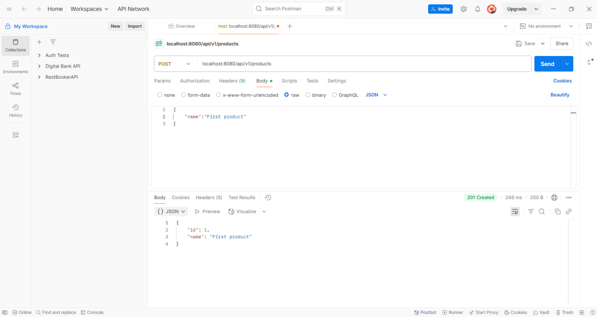
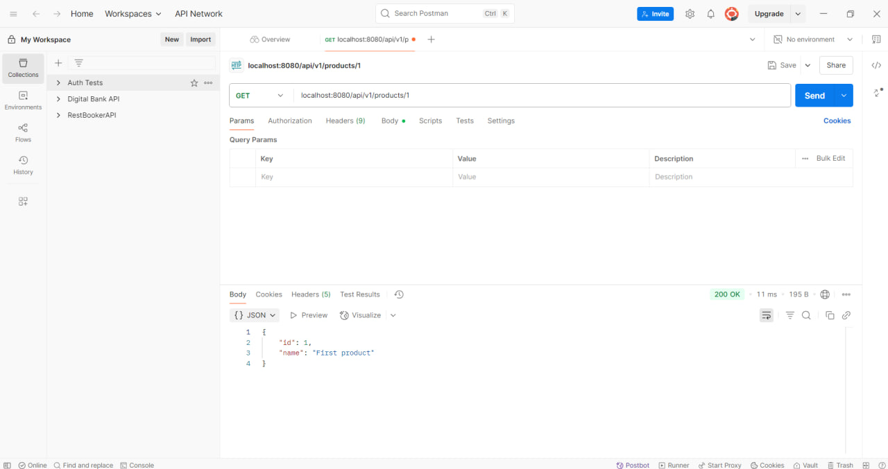
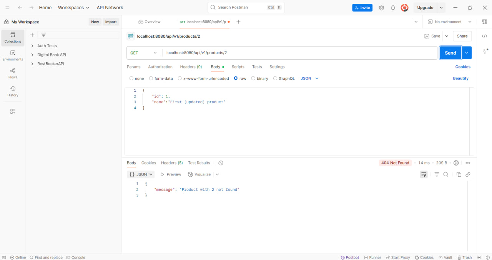
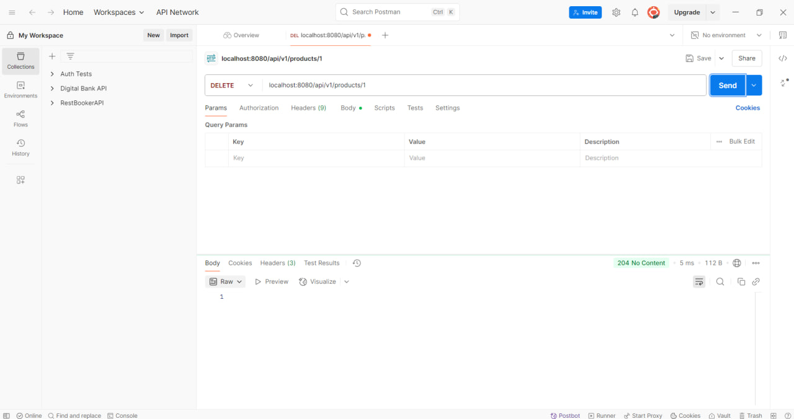
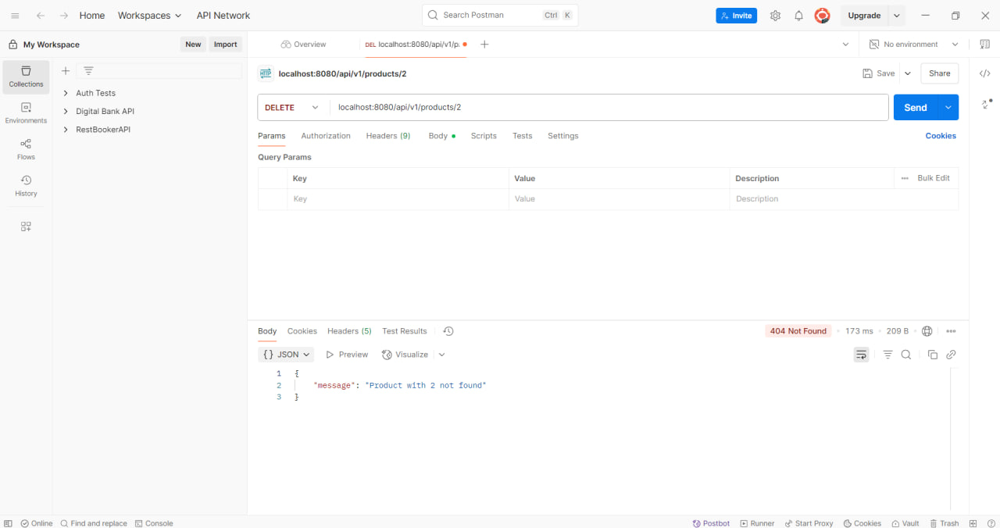
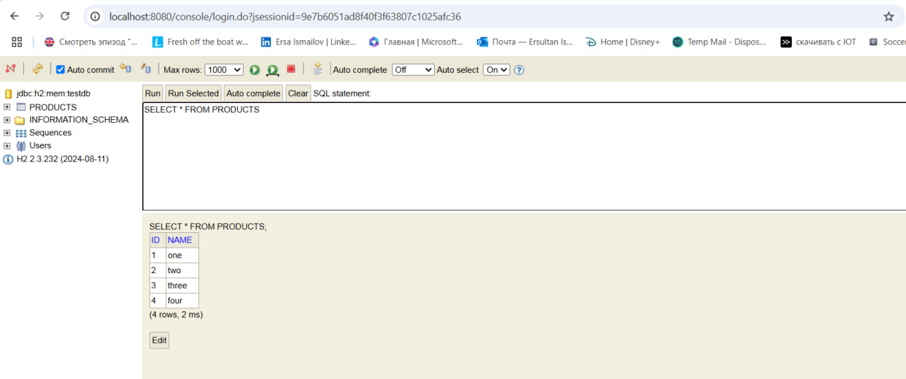
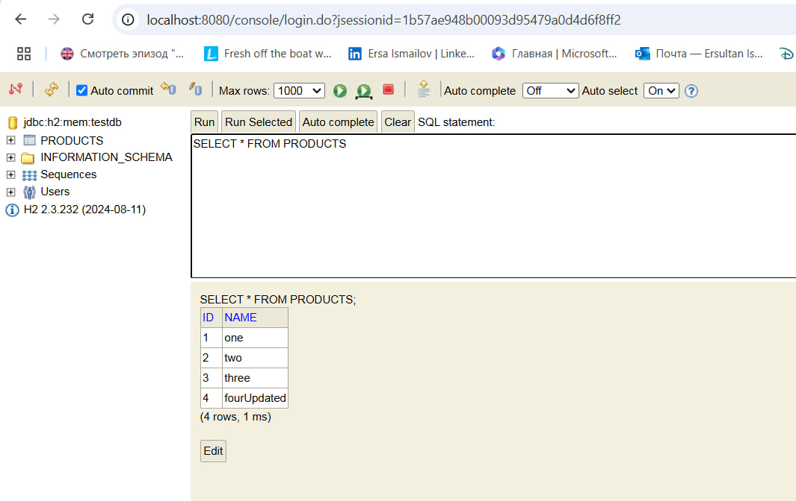

MyFirstRestApiProjectJava

DESCRIPTION:

Hello everyone,
This is a RESTful API with Spring Boot project on JAVA for managing product information. It allows users to create, read, update, and delete products using HTTP requests. Local server is http://localhost:8080

PROGRAM OPERATIONS (We can test the functionality using Postman):

1. To create new product we should use POST request and link (/api/v1/products). We need provide product name (also we can add price). Also in the Body section we should choose "raw" and JSON. We should get "201 created"

2. To retrieve product info we should use GET request and link (/api/v1/products/{id}). We should get "200 OK" status if it's successful, if not then "404 not found"

3. To update an existing product we should use PUT request and link (/api/v1/products/{id}). Also in the Body section we should choose "raw" and JSON. Need to provide updated info for the product. We should get "200 OK" if it was updated, if the product is not found, then "404 not found" status.

4. To delete product we should use DELETE and link (/api/v1/products/{id}). If it was deleted then we get "204 no content" status. If the product is not found, then "404 not found".

SCREENSHOTS

Here are screenshots demonstrating the API's functionality:

1. Successful POST Request: Creating a new product. 

2. Successful GET Request: Retrieving a product. 

3. Successful PUT Request: Updating an existing product 

4. GET Request - Product Not Found: Attempting to retrieve a non-existent product 

5. Successful DELETE Request: Deleting an existing product 

6. DELETE Request - Product Not Found: Attempting to delete a non-existent product 

7. H2 Console: Screenshot of the H2 Console showing database 

8. H2 Console - Updated Database: Screenshot of the H2 Console showing updated database 
